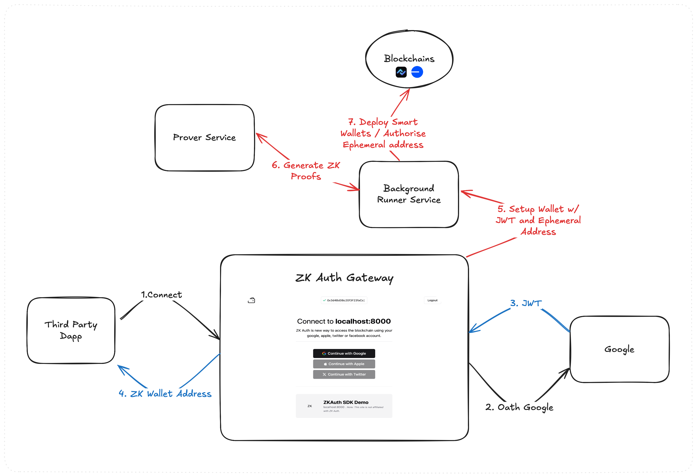

# ZKAuth SDK

ZKAuth is a zero-knowledge proof-based crypto wallet, controlled by your google, apple, twitter or facebook account, using ZK-Snarks to verify your identity without revealing any personal information on-chain.

## Usage

```bash
npm install @cryptokass/zkauth-sdk
```

```typescript
import { ZKAuth } from "@cryptokass/zkauth-sdk";

const zkauth = new ZKAuth({
  name: "My Awesome App",
  url: "https://example.com",
  icon: "https://example.com/icon.png",
});
```

### Connection

`zkauth.connect()` will open a popup displaying login options. Upon successful login, it will return the wallet address.

```typescript
const walletAddress = await zkauth.connect();
```

`zkauth.reconnect()` will attempt to use the same wallet as the last connection. If the user is not connected, it will prompt the user to connect.

Alternatively, you can connect directly with a given provider:

```typescript
const walletAddress = await zkauth.reconnect("google");
```

### Disconnect

```typescript
zkauth.disconnect();
```

Will disconnect the currently connected user.

### Send a transaction

```typescript
const txHash = await zkauth.sendTransaction({
  to: "0x123...",
  value: 1000000000000000000, // value in wei
});
```

### State

`zkauth.connected()` will return true if the user is connected, false otherwise.

```typescript
const isConnected = zkauth.connected();
```

`zkauth.currentUser()` will return the currently connected user, or null if the user is not connected.

```typescript
const walletAddress = zkauth.currentUser();
```

# How the ZKAuth SDK works

The SDK interacts with the ZKAuth gateway, which prompts users to login with their provider of choice, produces required ZK proofs, and creates/retrieves a users ZKAuth smart contract wallet, on all supported networks.

The SDK requires popup windows to be enabled for the domain of the DApp,
as it communicates with the gateway via the PostMessage API.

## The typical login flow looks like this:



1. The user clicks the connect button, which calls `zkauth.connect()`.
2. The SDK opens a popup prompting the user to select their login method. The gateway also creates/loads a local ephemeral key for temporary use with the smart wallet. It forwards the user to the OUAuth login page.
3. The Gateway receives the users OAuth JWT from the trusted provider for processing.
4. The Gateway infers the users smart wallet address from the JWT and returns it instantly to the SDK for display/use.

#### Background Tasks

5. The Gateway service triggers the wallet setup, if the smart wallet does not exist or the ephemeral key is not registered. The background service manages this setup, handling any failures and retries.
6. The background runner service forwards the request to a high-performance, secure zk-SNARK proving system which generates proofs for our Zero Knowledge Proof Circuits.
7. With the proofs generated, the background service creates the smart wallet on the desired network, and registers the ephemeral key.
